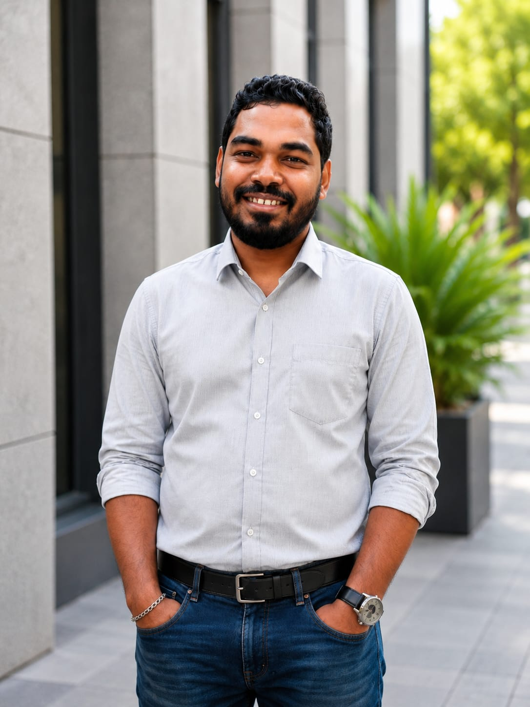

# Shankha Subhra Bag - Developer Portfolio

## About Me

I am a Senior Fullstack and eCommerce Developer with over 10 years of experience. I specialize in building custom, high-performance web applications, eCommerce solutions, and scalable business websites. 

My primary technical expertise includes:
- **Shopify Development:** Shopify Plus, Custom Themes (Liquid), Custom & Public Apps, Checkout Extensions, Headless Commerce (Hydrogen, Remix, React.js).
- **BigCommerce Development:** B2B & B2C Stores, Stencil, Custom Storefronts, API workflows, and Complex ERP/API Integrations.
- **WordPress & WooCommerce:** Custom Themes, Plugin Development, ACF-based solutions, and Custom Post Types.
- **Laravel Development:** Secure Web Applications, REST APIs, MySQL-based Systems, Job Queues, and eCommerce Automation Platforms.

I build reliable, user-centric applications tailored to complex business needs, integrating seamless front-end experiences with robust back-end systems.

## Portfolio Site

You can view my full portfolio and capabilities on this live site. 
- [Home Page](index.html)
- [Shopify Projects](shopify-projects.html)
- [BigCommerce Projects](bigcommerce-projects.html)
- [Laravel Projects](laravel-projects.html)
- [WordPress Projects](wordpress-projects.html)

## Contact Information

Feel free to reach out to discuss your next project or collaboration opportunities.

- **Email:** [shankha4030@gmail.com](mailto:shankha4030@gmail.com)
- **Phone:** [+91 9674364030](tel:+919674364030)

## Social Links

Let's connect:
- **LinkedIn:** [shankha-subhra-bag-developer](https://www.linkedin.com/in/shankha-subhra-bag-developer/)
- **GitHub:** [shankha-subhra](https://github.com/shankha-subhra)
- **Facebook:** [shankhasubhrabag](https://www.facebook.com/shankhasubhrabag/)
- **Instagram:** [@shankhasubhrabag](https://www.instagram.com/shankhasubhrabag)
